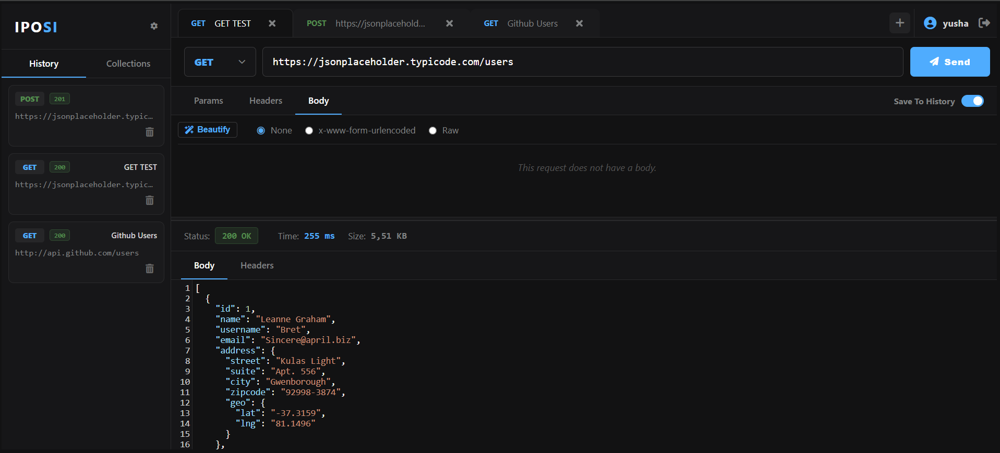

# Iposi - API Management Tool and Tester

Iposi is a personal API management and testing tool built with Delphi and UniGUI. It provides a workspace for creating, editing, sending, and managing HTTP requests without relying on external API clients.

The idea behind Iposi started from a simple need: having an API tool that works the way I want it to. Instead of depending on an existing application and adapting my workflow around it, Iposi is being developed as my own tool that I can change and extend whenever I need.

The name "Iposi" comes from the language Zulu word for "postman".

You can use Iposi from [here](https://hasup.net/iposi).
If you want to test local API's you have to use [Iposi Agent](https://github.com/yushadev0/iposi-agent).

---
## Screenshots and Demo Video

* A demo usage of Iposi.

* The main workspace of Iposi.

---

## Features

### Request Workspace

* Multiple API requests can be opened in separate tabs.
* Create new request tabs.
* Switch between requests without losing their state.
* Close, reorder and rename request tabs.
* HTTP method and URL are managed directly from the request bar.

### HTTP Methods

* GET
* POST
* PUT
* PATCH
* DELETE

### Request Parameters

* Query parameter management.
* Add and remove parameters dynamically.
* Key / Value based parameter editor.

### Request Headers

* Add and remove custom request headers.
* Key / Value based header editor.

### Request Body

* None
* x-www-form-urlencoded
* Raw body
* JSON
* Text
* HTML
* XML
* JavaScript
* Body beautification.
* Code editor based request body editing.

### Response Viewer

* HTTP status code.
* Response time.
* Response size.
* Response body viewer.
* Response headers viewer.

### History

* Previously executed requests can be displayed in the History section.
* Requests can be accessed from the workspace again.

### Collections

* Collection-based request organization.
* Designed to keep related API requests together.

### Workspace

* Dark themed interface.
* Resizable request and response panels.
* Sidebar for History and Collections.
* Custom request tabs.
* Custom dialogs and notifications.

---

## Why Iposi?

Iposi was not started with the goal of creating another general-purpose API client.

The starting point was my own workflow.

I wanted to have an API tool that I could control completely, modify whenever I needed, and shape around the way I work. Instead of adapting my workflow to an existing application, I decided to build the tool myself.

This also gives me the freedom to experiment with the interface, request model, workspace, and features without being limited by an existing product.

---

## Technology

* Delphi
* UniGUI
* HTML
* CSS
* JavaScript
* CodeMirror
* SQL Server

The application uses Delphi and UniGUI as the main application framework while the workspace interface is built with HTML, CSS, and JavaScript.

---

## Installation

Iposi is currently under active development.

Installation and deployment instructions will be added as the project reaches a more stable state.

---

## Usage

The current workflow is:

1. Open Iposi.
2. Create a new API request.
3. Select an HTTP method.
4. Enter the request URL.
5. Add parameters or headers if required.
6. Configure the request body if required.
7. Click Send.
8. Inspect the response status, time, size, body, and headers.

---

## Roadmap

* ~~Request Workspace~~
* ~~Multiple Request Tabs~~
* ~~HTTP Methods~~
* ~~Request Parameters~~
* ~~Request Headers~~
* ~~Request Body~~
* ~~Response Viewer~~
* ~~History~~
* Collections
* ~~**Iposi Local API Agent (to connect and test localhost APIs)**~~
* Environment Variables
* Authentication Management
* Response Headers
* Request/Response Cookies
* API Tests
* Import / Export
* More workspace improvements
* More features as needed

---

## Project Status

Iposi is an ongoing personal project.

The current version is functional, but the project is still being developed and new features are being added gradually. 

**Upcoming Milestone:** One of the most significant upcoming features is a dedicated **Local API Agent**. Currently, web-based API clients struggle to reach local development servers. In the near future, we will begin developing a lightweight local agent that will allow Iposi to securely tunnel and connect to local APIs (localhost) and internal networks without any hassle.

The roadmap is intentionally flexible. Features are added based on actual usage and requirements rather than trying to reproduce every feature of existing API clients.

---

## Contributing

The project is primarily developed for my own workflow, but bug reports, pull requests, and feature suggestions are welcome.

---

## Licence

This project uses MIT License.

---

Developed by Yuşa Göverdik.
